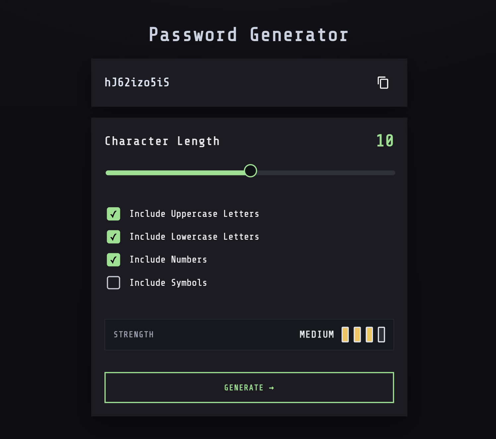

# Description 
A responsive **Password Generator Web** built using **HTML, CSS, and JavaScript**.

## Features
1. **Generate Password**
    - Adjustable length between 0 to 20 characters
    - Options to include: Uppercase letters, Lowercase letters, Numbers, Symbols
    - At least one character guranteed from each selected option
    - Secure shuffle using **Fisher-Yates algorithm** with `crypto-getRandomValues`

2. **Strength Meter**
    - Evaluate password strength (Weak, Medium, Strong)
    - Considers both **length** and **character diversity**
    - Visual Indicator with color-coded bars

3. **Clipboard Copy**
    - Copy generated password with one click
    - Visual "Copied!" toast feedback
    - Uses modern Clipboard API with safe fallback

4. **Accessibility**
    - Semantic HTML elements (`<output>`, `<fieldset>`, `<button>`)
    - ARIA roles and live regions for screen readers
    - Screen-reader only headings (`.sr-only`)
    - Visible focus outlines for keyboard navigation

## Preview

